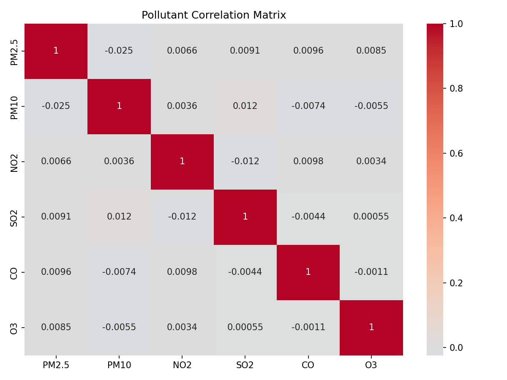
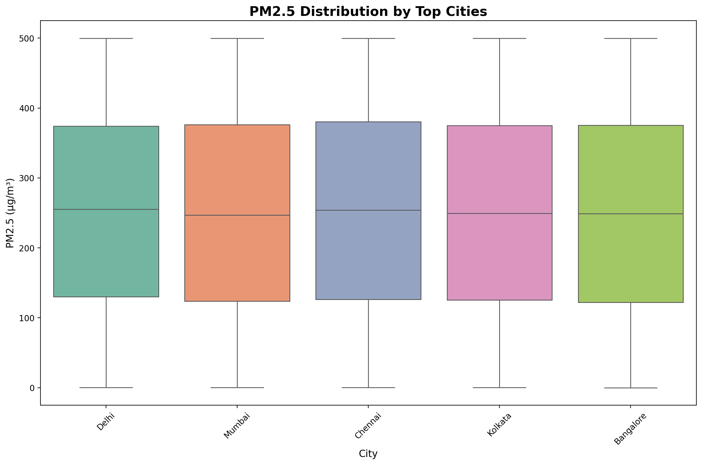
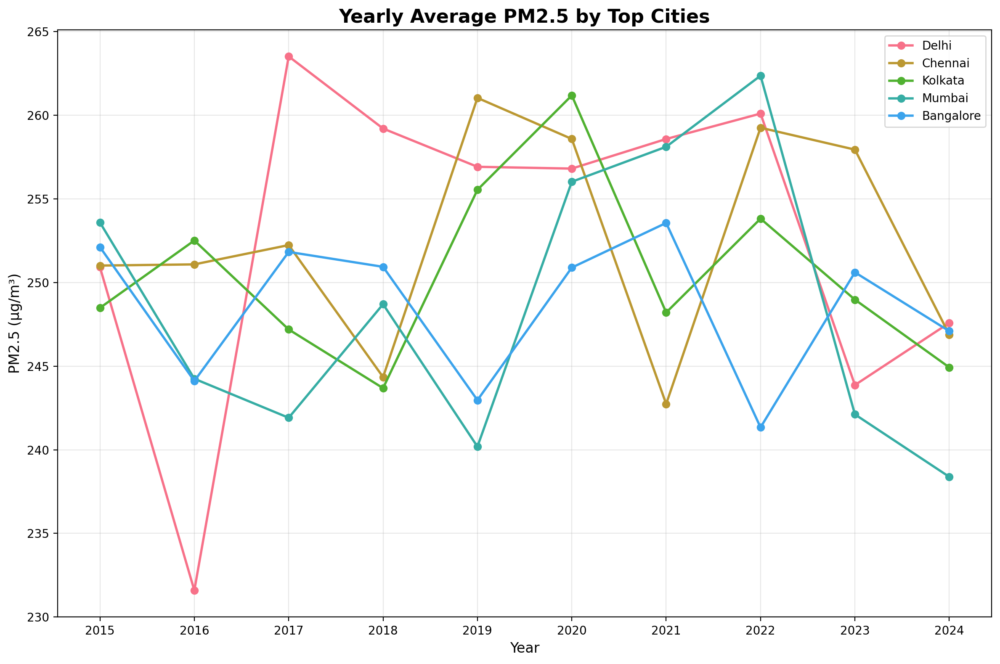
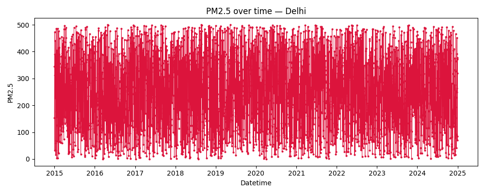
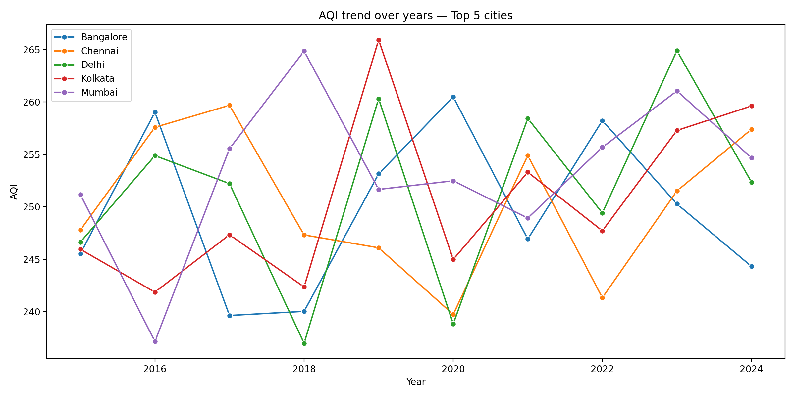
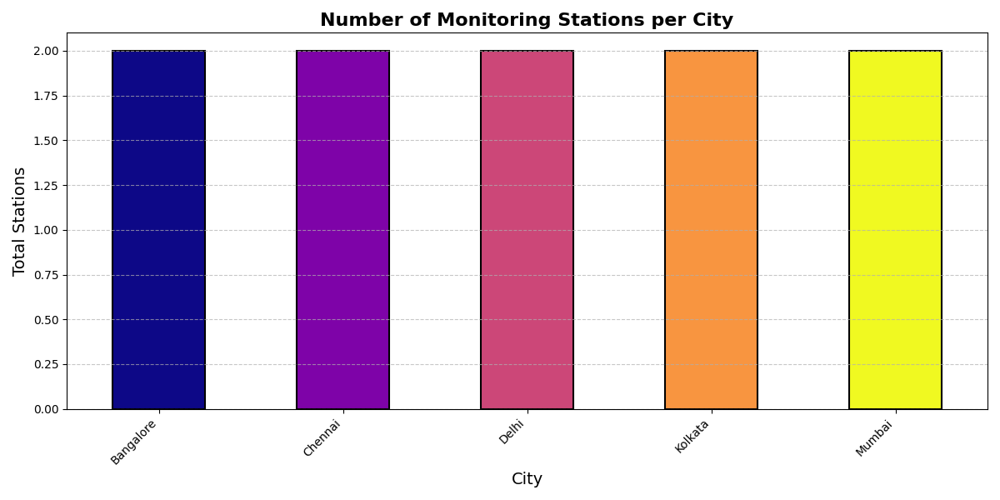

# Air Quality Analysis: India 2015-2024

Analysis of air pollution data across Indian cities using Python, Pandas, NumPy, Matplotlib, Seaborn, and Plotly.

## Features
- Data cleaning and preprocessing
- Monthly PM2.5 trend analysis by city
- Seasonal pollution patterns with value labels
- Pollutant correlation analysis
- City comparison boxplots
- Yearly average trends
- Interactive visualizations

## Quick Start

```bash
# Install requirements
pip install pandas numpy matplotlib seaborn plotly

# Run analysis
python scripts/clean_data.py
python scripts/analyze_data_enhanced.py
```

## Visualizations

### PM2.5 Monthly Trends


### Seasonal Analysis


### Pollutant Correlations


### City Comparison


### Yearly Trends


## Data Source
Kaggle: Air Quality Data in India (2015-2024)

## License
MIT
```

air-quality-data-2015-2024/
│
├── data/
│   ├── raw/        # Original CSV files
│   ├── processed/  # Processed datasets
│   └── output/     # Analysis outputs
│
├── visuals/        # Plots, graphs & dashboards
├── scripts/        # Python scripts for analysis
└── notebooks/      # Jupyter notebooks

````

---

## Tech Stack
- **Languages:** Python 3.10+  
- **Libraries:** Pandas, NumPy, Matplotlib, Seaborn  
- **Environment:** Jupyter Notebook / VS Code  
- **Tools:** Git & GitHub  
- **Concepts:** ETL, Time-Series Analysis, Data Visualization, Correlation Analysis

---

## Key Features
- **Automated Data Cleaning:** Removes duplicates, fixes missing values, standardizes dates.  
- **Trend Analysis:** PM2.5 trends over time for each dataset.  
- **Top Polluted Cities:** Ranking of cities by average AQI.  
- **Seasonal Trends:** Average pollutant levels by season.  
- **City Pollution Over Years:** Trends in AQI for top cities.  
- **Station Analysis:** Number of monitoring stations per city.  
- **Pollution Hotspots:** Clustering of cities by pollution levels.

---

## Key Visualizations
### PM2.5 Trends

Dive into the vibrant ebb and flow of PM2.5 pollution levels across Indian cities from 2015 to 2024. This striking line chart highlights seasonal spikes and yearly patterns, painting a clear picture of air quality evolution with bold, intuitive visuals.

### Seasonal Pollutant Trends

Uncover the dynamic distribution and seasonal rhythms of key pollutants in this colorful visualization. It vividly illustrates peak pollution periods, using engaging hues to make complex data patterns easy to grasp and remember.

### Top Polluted Cities

Ranked in a bold bar chart, this visualization spotlights India's most polluted cities by average AQI. With eye-catching colors and sharp contrasts, it delivers a compelling comparison of urban air quality challenges at a glance.

### Pollution Hotspots

Explore pollution hotspots through this innovative clustering analysis. Cities with similar pollution profiles are grouped in a visually appealing scatter plot, revealing geographical patterns with vibrant clusters that highlight regional air quality stories.

### City Pollution Over Years

Track the decade-long journey of pollution in selected cities with this elegant yearly summary chart. Featuring smooth lines and rich colors, it showcases trends and changes in air quality, making long-term insights both accessible and captivating.

### Stations per City

This informative bar chart displays the number of monitoring stations per city, using a palette of fresh colors to emphasize data coverage and reliability. It's a quick, visually engaging way to assess the robustness of air quality monitoring across India.

### Additional Charts
### Station PM2.5 Trend

Delve into weekly PM2.5 trends from individual stations in this polished visualization. With a harmonious color scheme, it provides a location-specific view of pollution levels, highlighting trends in air quality.

### Seasonal CO

Witness the seasonal dance of Carbon Monoxide (CO) levels in this lively chart. Using warm, inviting colors, it reveals how CO concentrations fluctuate across seasons, offering a fresh perspective on this critical pollutant.

### Seasonal NO

This visualization brings seasonal Nitrogen Oxide (NO) patterns to life with bold, contrasting hues. It helps decode seasonal impacts on NO levels, transforming data into an engaging narrative of urban pollution.

### Seasonal NO2

Explore Nitrogen Dioxide (NO2) trends through the seasons in this eye-popping chart. With a palette that pops, it provides clear insights into urban air pollution variations, making complex seasonal data feel approachable and fun.

### Seasonal O3

Highlighting Ozone (O3) concentrations, this chart uses serene yet striking colors to illustrate seasonal patterns. It spotlights periods of elevated ozone, delivering a visually soothing yet informative experience.

### Seasonal PM10

Track the seasonal ebb and flow of PM10 particulate matter in this robust visualization. Featuring earthy tones and clear lines, it offers a grounded view of how larger particulates fluctuate, with colors that evoke the natural cycles of pollution.

### Seasonal SO2

This chart vividly displays Sulfur Dioxide (SO2) seasonal variations with industrial-inspired colors. It aids in understanding seasonal influences on this pollutant, using a design that's as informative as it is visually striking.

### Pollutant Correlations

Heatmap showing correlations between pollutants in daily city data, revealing relationships with a plasma color scale.


Station-level daily correlations.

### Interactive Visualizations
[Interactive PM2.5 Trends](visuals/city_day_cleaned_pm25_trend_interactive.html)
Interactive weekly PM2.5 trends by city.

[Interactive Top Polluted Cities](visuals/top_polluted_cities_interactive.html)
Interactive bar chart of top polluted cities.

[Interactive Seasonal PM2.5 Trends](visuals/seasonal_pm25_trends_interactive.html)
Interactive seasonal trends.

[Interactive Correlations](visuals/city_day_cleaned_correlation_interactive.html)
Interactive correlation heatmap.

### City Comparison Dashboard
[Interactive City Comparison Dashboard](visuals/city_comparison_dashboard.html)
An interactive HTML dashboard built with Plotly, allowing users to compare pollution levels across cities dynamically. Explore trends, averages, and insights with engaging, interactive charts that bring the data to life in a fully immersive, colorful experience.

## Original Raw Data (preview)

Below are the original CSV files provided (from Kaggle). For each file I show the approximate number of rows, number of columns, the header, and two sample rows so reviewers can see the raw schema and data format quickly.

- `data/raw/city_day.csv` — rows: ~18,266; columns: 16

```
Header: City,Datetime,PM2.5,PM10,NO,NO2,NOx,NH3,CO,SO2,O3,Benzene,Toluene,Xylene,AQI,AQI_Bucket
Sample:
Delhi,2015-01-01,153.3,241.7,182.9,33.0,81.3,38.5,1.87,64.5,83.6,18.93,20.81,8.32,204.5,Severe
Mumbai,2015-01-01,70.5,312.7,195.0,42.0,122.5,31.5,7.22,83.8,108.0,2.01,19.41,2.86,60.9,Satisfactory
```

- `data/raw/city_hour.csv` — rows: ~438,246; columns: 16

```
Header: City,Datetime,PM2.5,PM10,NO,NO2,NOx,NH3,CO,SO2,O3,Benzene,Toluene,Xylene,AQI,AQI_Bucket
Sample:
Delhi,2015-01-01 00:00:00,258.0,340.6,191.0,13.4,104.1,16.2,1.15,39.8,70.4,11.64,10.23,1.95,411.5,Moderate
Mumbai,2015-01-01 00:00:00,120.1,47.9,165.3,57.9,139.2,14.4,0.76,3.3,23.2,11.35,11.38,1.53,134.8,Poor
```

- `data/raw/stations.csv` — rows: ~11; columns: 2

```
Header: City,Station
Sample:
Delhi,Station_D1
Delhi,Station_D2
```

- `data/raw/station_day.csv` — rows: ~36,531; columns: 17

```
Header: City,Datetime,Station,PM2.5,PM10,NO,NO2,NOx,NH3,CO,SO2,O3,Benzene,Toluene,Xylene,AQI,AQI_Bucket
Sample:
Delhi,2015-01-01,Station_D1,58.3,223.2,126.6,85.5,207.5,18.4,0.25,42.7,184.9,8.03,12.72,4.1,266.4,Moderate
Mumbai,2015-01-01,Station_M1,36.6,160.8,164.2,18.6,94.8,8.9,6.84,70.7,195.4,5.53,26.93,2.64,5.9,Moderate
```

- `data/raw/station_hour.csv` — rows: ~7,211; columns: 17

```
Header: City,Datetime,Station,PM2.5,PM10,NO,NO2,NOx,NH3,CO,SO2,O3,Benzene,Toluene,Xylene,AQI,AQI_Bucket
Sample:
Delhi,2015-01-01 00:00:00,Station_D1,243.1,193.5,182.4,58.8,100.9,30.4,3.08,24.3,166.7,12.66,18.42,1.91,301.5,Good
Delhi,2015-01-01 00:00:00,Station_D2,476.7,504.0,172.4,80.7,114.4,30.3,7.96,48.1,72.9,8.35,26.53,1.66,243.1,Satisfactory
```

## Key Insights
- Delhi consistently ranks highest in PM2.5 levels.  
- Winter months show peak pollution across most cities.  
- Southern cities have comparatively lower pollution levels.  
- PM2.5 and PM10 are strongly correlated.  
- AQI improved slightly after the 2020 lockdown.

---

## Requirements

The project dependencies are listed below (from `requirements.txt`):

```
pandas==2.3.3
numpy==2.3.5
matplotlib==3.10.7
seaborn==0.13.2
plotly==6.5.0
scikit-learn==1.7.2
scipy==1.16.3
statsmodels==0.14.5
matplotlib-venn==1.1.2
pillow==12.0.0
```

## Installation & Usage

### 1️⃣ Clone & Navigate
```bash
# Clone the repository
git clone https://github.com/Abhinav-TheAnalyst/air-quality-india-2015-2024.git
cd air-quality-india-2015-2024
````

### 2️⃣ Install Dependencies

```bash
# (optional) Create and activate a virtual environment (PowerShell)
python -m venv .venv
. .venv\Scripts\Activate.ps1

# Install required Python libraries from the pinned requirements file
pip install -r requirements.txt
```

### 3️⃣ Run Data Cleaning

```bash
# Run the cleaning script
python scripts/clean_data.py
```

### Quick demo

Run the small example script (prints a summary and saves a demo PM2.5 plot):

```powershell
python .\scripts\run_example.py
```

### 4️⃣ Run Analysis & Visualizations

```bash
# Run data cleaning
python scripts/clean_data.py

# Run analysis and generate visualizations
python scripts/analyze_data.py
python scripts/analyze_data_enhanced.py
python scripts/analyze_stations.py
python scripts/city_pollution_over_years.py
python scripts/pollution_hotspots.py
python scripts/seasonal_trends.py
python scripts/top_polluted_cities.py

# Generate reports and dashboards
# Generate a lightweight summary report (markdown)
python scripts/generate_summary.py
python scripts/interactive_visualizations.py
python scripts/city_comparison_dashboard.py
python scripts/missing_values_report.py

# Run all scripts at once
python scripts/run_all.py
```

## Contributing

Contributions are welcome!

* Fork the repo
* Create a branch (`git checkout -b feature-name`)
* Make improvements or add features
* Submit a pull request

---

## Author

**Abhinav Verma** – Aspiring Data Analyst / Data Scientist

* LinkedIn: [LinkedIn](https://www.linkedin.com/in/abhinav-theanalyst/)
* GitHub: [Abhinav-TheAnalyst](https://github.com/Abhinav-TheAnalyst)

---

## License

This project is licensed under the **MIT License** – see the [LICENSE](LICENSE) file for details.

---

## Reflections — What I learned

- Worked with a large, real-world dataset (Kaggle) covering 2015–2024 and learned practical data cleaning strategies (duplicate removal, date standardization, numeric coercion, median imputation for pollutants).
- Practiced time-series aggregation and visualization to reveal trends (daily/hourly aggregation and yearly summaries). 
- Performed seasonal analysis and basic statistical testing (ANOVA + Tukey HSD) to evaluate seasonal pollutant differences.
- Built reproducible analysis scripts and a small demo runner (`scripts/run_example.py`) so reviewers can quickly run a demo.
- Learned how to prepare outputs for sharing: CSV summaries in `output/` and visuals in `visuals/`; replaced a bulky PDF report with a lightweight `output/summary_report.md` and a small generator script to recreate it.

If you'd like, I can expand this section with specific lessons (libraries used, pitfalls, improvements you would make next) or convert it into a short 'Lessons learned' slide for portfolio use.