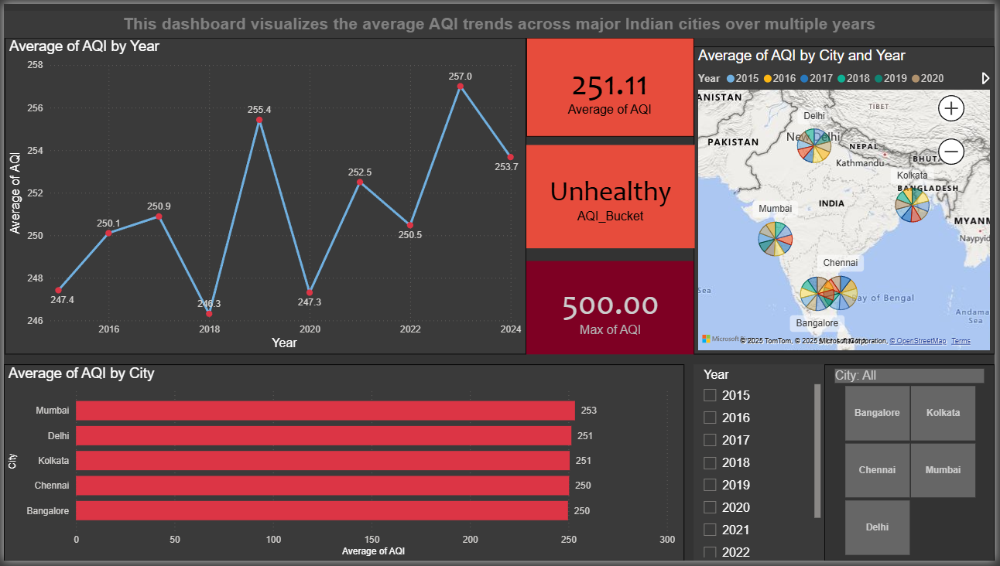
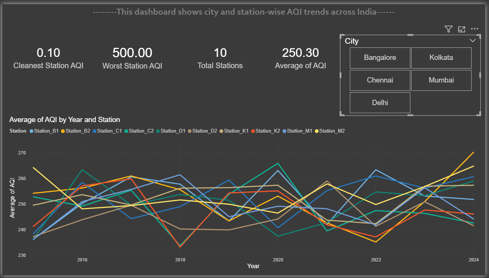
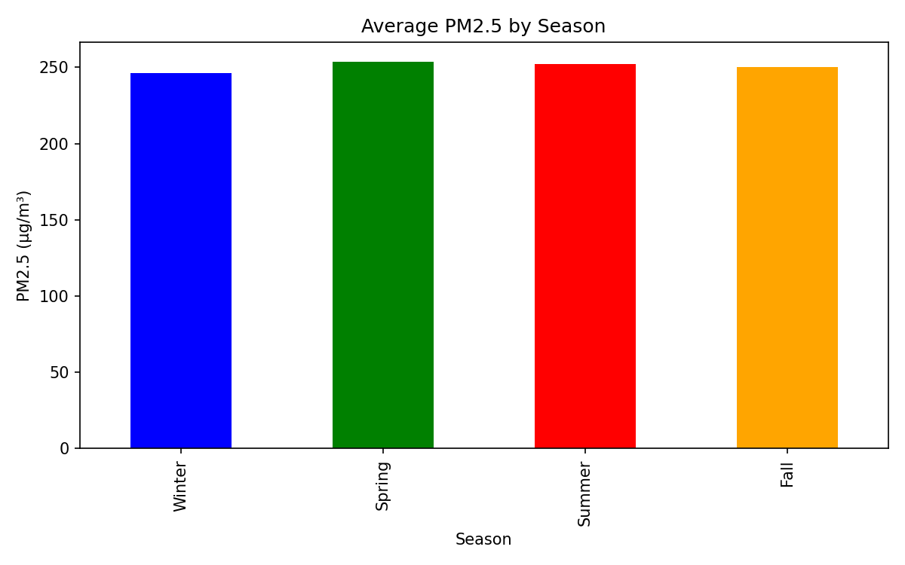
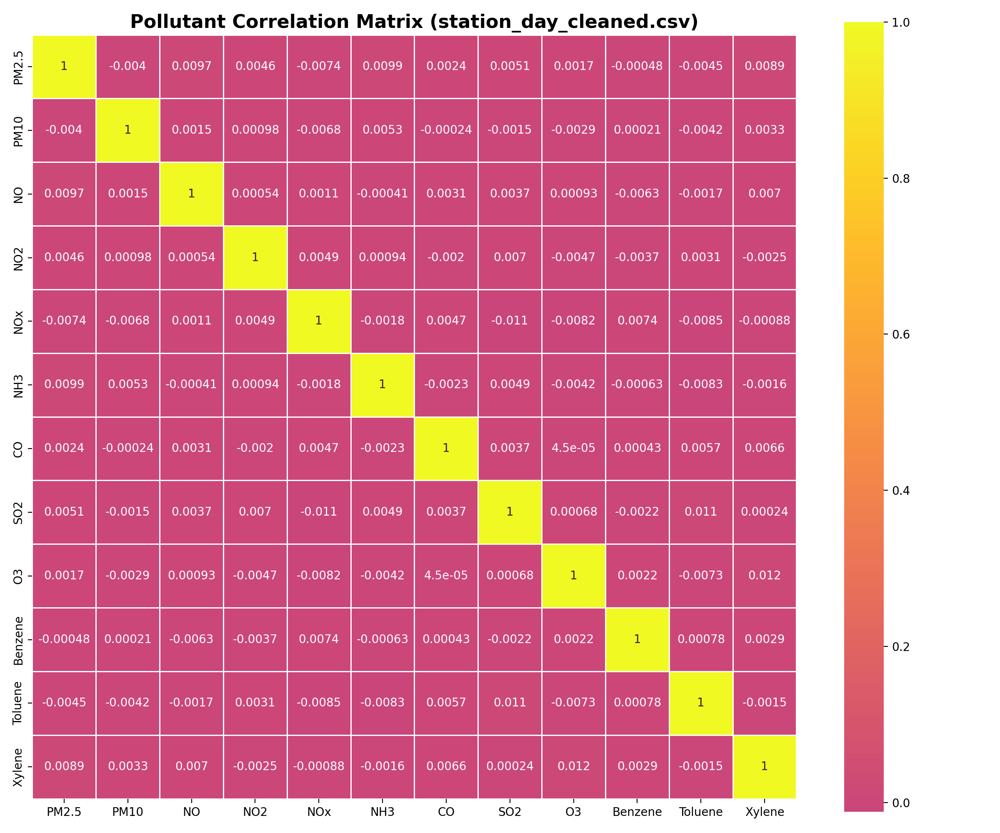
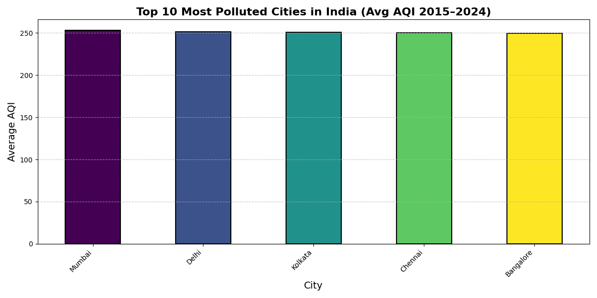

# Air Quality Analysis: India 2015-2024

[](https://www.python.org/)
[](https://pandas.pydata.org/)
[](https://numpy.org/)
[](https://matplotlib.org/)
[](https://seaborn.pydata.org/)
[](https://plotly.com/)

## 📊 Project Overview

This repository contains an analysis of air quality data collected from various monitoring stations across Indian cities. The dataset covers 10 years of daily air quality measurements, providing insights into pollution patterns, seasonal variations, and city-wise comparisons.

## 📊 Dashboards

### 1. **Overall Air Quality Pollutants Dashboard**  
(`Dash1-Pollutants.pbix`)
- 🌍 City-wide air quality overview
- 📍 Comparative analysis between cities
- 📅 Monthly/Quarterly trends




### 2. **Station Performance Dashboard** 
(`Dash2-StationAnalysis.pbix`)
- 🔍 Individual station tracking across 10 stations
- 📈 AQI trends and pollutant breakdown
- 📊 Year-on-year comparisons
- ⏰ Seasonal patterns analysis



## 🏢 Cities Covered
- Delhi (2 stations)
- Mumbai (2 stations)
- Bangalore (2 stations)
- Chennai (2 stations)
- Kolkata (2 stations)

## 📈 Data Points

**Pollutants Tracked:**
- PM2.5, PM10, NO, NO2, NOx, NH3, CO, SO2, O3, Benzene, Toluene, Xylene

**Time Period:** 2015-2024 (18,265+ records)

## ✨ Key Features

- **Data Cleaning Pipeline**: Automated preprocessing of raw data with missing value imputation
- **Trend Analysis**: Monthly and yearly PM2.5 trends for major cities
- **Seasonal Patterns**: Analysis of pollution variations across seasons
- **Correlation Studies**: Relationships between different pollutants
- **City Comparisons**: Statistical comparison of air quality across cities
- **Interactive Visualizations**: Web-based dashboards for data exploration

## 📋 Index (quick links)

- [Project Overview](#project-overview)
- [Key Features](#key-features)
- [Getting Started](#getting-started)
- [Analysis Results](#analysis-results)
- [Project Structure](#project-structure)
- [Technologies](#technologies)
- [Data Variables](#data-variables)
- [Contributing](#contributing)
- [License](#license)

---

## 🚀 Getting Started

### Prerequisites
- Python 3.14+
- pip package manager

### Installation

1. Clone the repository:
```bash
git clone https://github.com/Abhinav-TheAnalyst/air-quality-india-2015-2024.git
cd air-quality-india-2015-2024
```

2. Install dependencies:
```bash
pip install -r requirements.txt
```

### Usage

1. Clean the raw data:
```bash
python scripts/clean_data.py
```

2. Run the main analysis:
```bash
python scripts/air_quality_analysis.py
```

3. Generate additional reports (optional):
```bash
python scripts/city_ranking.py
python scripts/seasonal_analysis.py
```

## 📈 Analysis Results

### PM2.5 Monthly Trends
Monthly averaged PM2.5 levels showing long-term trends for top polluted cities.


### Seasonal Pollution Patterns
Average PM2.5 concentrations across different seasons, highlighting winter peaks.



### Pollutant Correlations
Heatmap showing relationships between major air pollutants.
 
## Project Overview

This repository analyzes air quality measurements from multiple Indian cities over 2015–2024. The focus is on clear data preparation, interpretable visualizations, and reproducible scripts.

## Key Features

- Data cleaning and preprocessing
- Monthly and yearly PM2.5 trend analysis
- Seasonal comparisons and labeled bar charts
- Pollutant correlation heatmaps
- City-level distribution comparisons (boxplots)
- Simple interactive dashboards (optional)

## Getting Started

### Prerequisites
- Python 3.8+ installed
- pip available

### Installation

Clone and install:
```powershell
git clone https://github.com/Abhinav-TheAnalyst/air-quality-india-2015-2024.git
cd "air-quality-india-2015-2024"
pip install -r requirements.txt
```

### Quick commands
```powershell
# Clean data
python scripts/clean_data.py

# Run the main analysis (creates images in visuals/)
python scripts/air_quality_analysis.py

# Optional reports
python scripts/city_ranking.py
python scripts/seasonal_analysis.py
```

## Analysis Results

Example outputs (saved to `visuals/`):

- `pm25_trend.png` — Monthly PM2.5 trends for top cities
- `seasonal_pm25.png` — Average PM2.5 by season with labels
- `pollution_correlation.png` — Correlation heatmap for pollutants
- `city_pm25_boxplot.png` — Boxplots comparing city PM2.5 distributions
- `yearly_pm25_trends.png` — Annual averages across top cities

## Project Structure

```
air-quality-india-2015-2024/
│
├── data/
│   └── processed/           # Cleaned and processed data (used by scripts)
│
├── scripts/                 # Python analysis scripts
│   ├── clean_data.py        # Data preprocessing
│   ├── air_quality_analysis.py  # Main analysis and visualization
│   ├── city_ranking.py      # City ranking analysis
│   ├── seasonal_analysis.py # Seasonal pattern analysis
│   └── interactive_visualizations.py  # Interactive plots
│
├── visuals/                 # Generated charts and plots (output)
├── output/                  # Analysis results and summaries
│
├── config.py                # Optional configuration
├── requirements.txt         # Python dependencies
├── README.md                # This file
└── LICENSE                  # MIT License
```

> Note: The `data/raw/` folder (original source CSVs) is not included in the public README listing. If you need the raw source files, they can be downloaded from the Kaggle dataset linked below.

## Technologies

- Python, Pandas, NumPy
- Matplotlib, Seaborn for static plots
- Plotly for interactive charts (optional)
- Power bi for dashboards

## Data Variables

Common columns in processed data:

- `PM2.5`, `PM10` — particulate matter (µg/m³)
- `NO`, `NO2`, `NOx` — nitrogen oxides (µg/m³)
- `SO2` — sulfur dioxide (µg/m³)
- `CO` — carbon monoxide (mg/m³)
- `O3` — ozone (µg/m³)
- `AQI` — air quality index

## Contributing

Contributions welcome. Open an issue or submit a PR with small, focused changes.

## License

MIT — see the `LICENSE` file.

## Data Source

Kaggle: Air Quality Data in India (2015-2024) — https://www.kaggle.com/datasets/rohanrao/air-quality-data-in-india
Track the seasonal ebb and flow of PM10 particulate matter in this robust visualization. Featuring earthy tones and clear lines, it offers a grounded view of how larger particulates fluctuate, with colors that evoke the natural cycles of pollution.

### Seasonal SO2

This chart vividly displays Sulfur Dioxide (SO2) seasonal variations with industrial-inspired colors. It aids in understanding seasonal influences on this pollutant, using a design that's as informative as it is visually striking.

### Pollutant Correlations

Heatmap showing correlations between pollutants in daily city data, revealing relationships with a plasma color scale.


Station-level daily correlations.

### Interactive Visualizations (static previews)
Below are static previews of the main interactive dashboards — these render reliably on GitHub. The interactive HTML files are included in `visuals/`, but GitHub's file viewer may not execute the embedded JavaScript. See the note below to open them locally.

- **PM2.5 Monthly Trends (preview):**

	

- **Seasonal PM2.5 Trends (preview):**

	

- **Pollutant Correlations (preview):**

	

- **Top Polluted Cities (preview):**

	

Note: The interactive HTML files are in the `visuals/` folder (for example `visuals/city_day_cleaned_pm25_trend_interactive.html`). To view them locally (recommended):

```powershell
# From the project root
python -m http.server 8000
# Open in your browser:
# http://localhost:8000/visuals/city_day_cleaned_pm25_trend_interactive.html
```

To (re)generate the interactive files locally, run:

```powershell
python .\scripts\interactive_visualizations.py
```
 
<!-- Original raw data preview removed from README. Raw CSVs remain in `data/raw/` if you need them locally. -->

## Key Insights
- Delhi consistently ranks highest in PM2.5 levels.  
- Winter months show peak pollution across most cities.  
- Southern cities have comparatively lower pollution levels.  
- PM2.5 and PM10 are strongly correlated.  
- AQI improved slightly after the 2020 lockdown.

---

## Requirements

The project dependencies are listed below (from `requirements.txt`):

```
pandas==2.3.3
numpy==2.3.5
matplotlib==3.10.7
seaborn==0.13.2
plotly==6.5.0
scikit-learn==1.7.2
scipy==1.16.3
statsmodels==0.14.5
matplotlib-venn==1.1.2
pillow==12.0.0
```

## Installation & Usage

### 1️⃣ Clone & Navigate
```bash
# Clone the repository
git clone https://github.com/Abhinav-TheAnalyst/air-quality-india-2015-2024.git
cd air-quality-india-2015-2024
````

### 2️⃣ Install Dependencies

```bash
# (optional) Create and activate a virtual environment (PowerShell)
python -m venv .venv
. .venv\Scripts\Activate.ps1

# Install required Python libraries from the pinned requirements file
pip install -r requirements.txt
```

### 3️⃣ Run Data Cleaning

```bash
# Run the cleaning script
python scripts/clean_data.py
```

### Quick demo

Run the small example script (prints a summary and saves a demo PM2.5 plot):

```powershell
python .\scripts\run_example.py
```

### 4️⃣ Run Analysis & Visualizations

```bash
# Run data cleaning
python scripts/clean_data.py

# Run analysis and generate visualizations
python scripts/analyze_data.py
python scripts/analyze_data_enhanced.py
python scripts/analyze_stations.py
python scripts/city_pollution_over_years.py
python scripts/pollution_hotspots.py
python scripts/seasonal_trends.py
python scripts/top_polluted_cities.py

# Generate reports and dashboards
# Generate a lightweight summary report (markdown)
python scripts/generate_summary.py
python scripts/interactive_visualizations.py
python scripts/city_comparison_dashboard.py
python scripts/missing_values_report.py

# Run all scripts at once
python scripts/run_all.py
```

## Contributing

Contributions are welcome!

* Fork the repo
* Create a branch (`git checkout -b feature-name`)
* Make improvements or add features
* Submit a pull request

---

## Author

**Abhinav Verma** – Aspiring Data Analyst / Data Scientist

* LinkedIn: [LinkedIn](https://www.linkedin.com/in/abhinav-theanalyst/)
* GitHub: [Abhinav-TheAnalyst](https://github.com/Abhinav-TheAnalyst)

---

## License

This project is licensed under the **MIT License** – see the [LICENSE](LICENSE) file for details.

---

## Reflections — What I learned

- Worked with a large, real-world dataset (Kaggle) covering 2015–2024 and learned practical data cleaning strategies (duplicate removal, date standardization, numeric coercion, median imputation for pollutants).
- Practiced time-series aggregation and visualization to reveal trends (daily/hourly aggregation and yearly summaries). 
- Performed seasonal analysis and basic statistical testing (ANOVA + Tukey HSD) to evaluate seasonal pollutant differences.
- Built reproducible analysis scripts and a small demo runner (`scripts/run_example.py`) so reviewers can quickly run a demo.
- Learned how to prepare outputs for sharing: CSV summaries in `output/` and visuals in `visuals/`;
